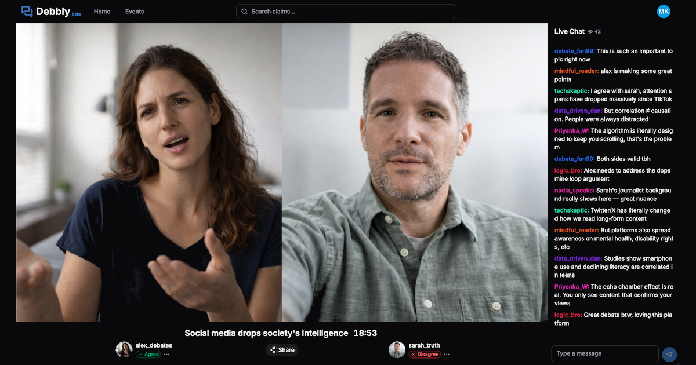

# Debbly

This is the Kotlin/Spring Boot backend for online video debating platform "Debbly" — think **Twitch, but for debates**.

## What is Debbly?

Debbly brings real-time video debates to the web, allowing users to engage in live discussions on topics they care about.
Whether you want to watch thought-provoking debates or jump into the arena yourself, Debbly provides the platform.

### Core Features

- **Watch Live Debates** — Tune into real-time video debates on various topics
- **Live Chat** — Interact with other viewers during debates
- **Host Debates** — Start your own debate stage and invite challengers
- **Automatic Matchmaking** — Get matched with opponents who want to debate the same topic
- **Claims & Topics** — Browse and debate specific claims and positions
- **User Profiles** — Build your debating reputation and track your history

### How It Works

1. **Browse Claims** — Find topics and claims you want to debate
2. **Take the Stage** — Click to host or join a debate on a claim
3. **Get Matched** — The matchmaking system pairs you with an opponent
4. **Debate Live** — Engage in real-time video debate while viewers watch and chat
5. **Build Your Profile** — Track your debate history and grow your audience

## Tech Stack
- Kotlin + Spring Boot
- Supabase Auth (GoTrue, self hosted)
- PostgreSQL + pgvector (main DB + embeddings)
- Redis (matchmaking queue, caching)
- LiveKit (real-time video/audio)
- Pusher (real-time events)
- OpenAI API (moderation, embeddings, topic extraction)
